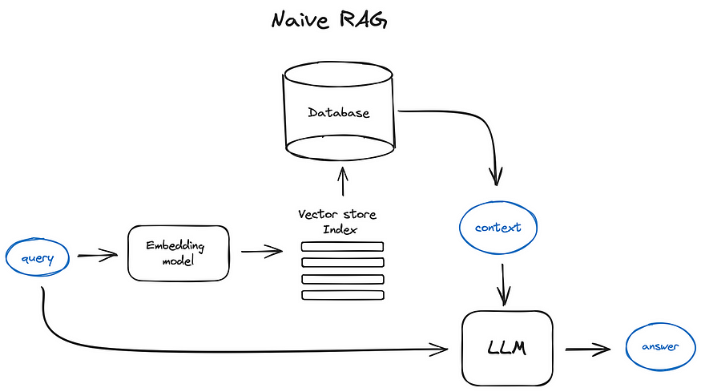
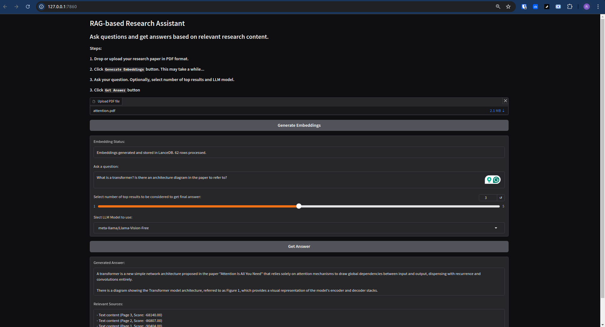

# Research Assistant

This is your friendly Research Assistant which is a RAG application built with LLM.


This Research Assistant utilizes a Retrieval-Augmented Generation (RAG) approach with Large Language Models (LLMs). RAG combines the power of information retrieval with the generative capabilities of LLMs, allowing the system to access and leverage relevant information from the uploaded research papers. This enables more accurate, context-aware responses to user queries about specific research content.

### RAG Application Architecture

Below is a generic diagram illustrating the architecture of a Retrieval-Augmented Generation (RAG) application:




## Problem Description

**Research Assistant** aims to address a common issue faced by Technology professionals—reading and understanding research papers efficiently and accurately. Tech professionals frequently have questions related to proposed architecture, technical issues, solutions, use cases and other general inquiries. Reading through research papers trying to find relevant information can be time consuming and resource-intensive for tech teams.

#### Key Challenges:

- **Information Overload**: Research papers often contain dense, technical information, making it challenging to quickly extract relevant details.
- **Time Constraints**: Technology professionals often need to review multiple papers in a limited timeframe, which can be overwhelming and inefficient.
- **Contextual Understanding**: Grasping the full context and implications of research findings, especially in relation to specific use cases or applications, can be difficult without deep domain expertise.


## Project overview

#### What Does the Research Assistant do?

The **Research Assistant** helps users by providing immediate and accurate answers to questions about uploaded research papers. Key functionalities include:

- **Document Upload**: Users can upload research papers in PDF format.
- **Natural Language Queries**: Users can ask questions about the paper in plain english language.
- **Intelligent Extraction**: The system analyzes the paper and extracts relevant information to answer queries.
- **Context-Aware Responses**: Answers are generated based on the specific content of the uploaded paper.
- **Summary Generation**: Users can request concise summaries of specific sections or the entire paper.
- **Key Insights Identification**: The system can highlight main findings, methodologies, and conclusions.


## Dataset

The dataset for this project consists of a seminal research paper in the field of natural language processing:

- Title: "Attention Is All You Need"
- Authors: Ashish Vaswani, Noam Shazeer, Niki Parmar, Jakob Uszkoreit, Llion Jones, Aidan N. Gomez, Lukasz Kaiser, Illia Polosukhin
- Publication: Advances in Neural Information Processing Systems 30 (NIPS 2017)
- Content: Introduces the Transformer architecture, which has become foundational in modern NLP models
- Impact: Revolutionized the field of machine translation and influenced numerous subsequent AI developments

You can find data in [`data/raw/attention.pdf`](data/raw/attention.pdf).

It was sourced from [here](https://arxiv.org/pdf/1706.03762).

Users can upload their own research paper in PDF format for analysis and querying.


## Technologies

- Python 3.12
- `pymupdf` for extracting text chunks and images
- `lancedb` for vector database/store
- LLMs and frameworks:
    - Sentence Transformers: For generating embeddings
        - nomic ai(`nomic-ai/nomic-embed-text-v1.5`)
        - CLIP pretrained(`openai/clip-vit-base-patch32`),
    - together ai(`meta-llama/Llama-Vision-Free`): For generating answers
- `Gradio` for application user interface
- `Docker` for containerization
- `AWS Elastic Beanstalk` for cloud deployment


## Prerequisites

1. Since we use together AI, you need to provide the API key.
    - Go to [together ai](https://api.together.ai/)
    - Create API Key

2. GitHub:
    - Create repo:`research-assistant-mm-rag`
    - Start codespace and connect to it from your IDE e. g. VS Code

3. Codespace:

    - Install `direnv`. If you use Ubuntu, run `sudo apt install direnv` and then `direnv hook bash >> ~/.bashrc`.

        Alternatively, follow instructions from https://direnv.net/docs/installation.html
    - Copy `.envrc_template` into `.envrc` and insert your key there.
    - Run `direnv allow` to load the key into your environment.

4. For dependency management, we use pipenv during experimentation and containerization, so you need to install it:
```python
pip install pipenv
```

Once installed, you can install the app dependencies:
```python
    pipenv install pymupdf sentence-transformers pandas pillow scikit-learn einops lancedb transformers together python-dotenv tqdm gradio rouge-score

    pipenv install --dev notebook==7.1.2 ipywidgets
```


## Steps to run the application locally (reproduce)

1. Complete the steps from prerequisites section.
2. Clone the repository
```python
git clone https://github.com/ranga4all1/research-assistant-mm-rag.git
```
3. Rename `..env-template` to `.env` and insert your key there: TOGETHER_API_KEY='your_key'
4. Navigate to the project application directory and install dependencies
```python
cd research-assistant-mm-rag
pipenv install
```
4. Run the ingestion pipeline first and then run the application
```python
cd research-assistant
pipenv run python ingest.py
pipenv run python gradio-app.py
```
Open this link in your browser to use the app: `http://localhost:7860` and follow onscreen instructions.



### code

The code for the application is in the [`research-assistant`](research-assistant) folder:

- [`ingest.py`](research-assistant/ingest.py) - the ingestion pipeline for the data
- [`rag.py`](research-assistant/rag.py) - the RAG logic
- [`gradio-app.py`](research-assistant/gradio-app.py) - the gradio application


## Containerization

Note: Ensure you have enough disk space to build the docker image.

1. Complete the steps from earlier loacal reproduce section.
2. From project root directory build docker image and then run it:
```python
docker build -t research-assistant-mm-rag .
docker run -p 7860:7860 research-assistant-mm-rag
```

Alternatively you can run:
```python
docker-compose up --build
```
3. Access gradio application at http://localhost:7860 and and follow onscreen instructions.

###  code

The code for the containerization is in the root folder:

- [.dockerignore](.dockerignore) - Docker ignore file
- [Dockerfile](Dockerfile) - Dockerfile
- [docker-compose.yml](docker-compose.yml) - Docker compose file
- [Pipfile](Pipfile) - Pipfile
- [Pipfile.lock](Pipfile.lock) - Pipfile lock


## Cloud Deployment

1. Create an account in AWS Cloud
2. Install aws elastic beanstalk cli
```python
pipenv install awsebcli --dev
```
3. Initialize the project and Elastic Beanstalk environment
```python
pipenv shell
eb init -p docker -r us-west-2 research-assistant-serving
```
3. Test locally
```python
eb local run --port 7860
```
4. Deploy the application
```python
eb create research-assistant-serving
```
5. Access the application at the given URL and follow onscreen instructions
6. Once tested terminate the environment/application to avoid incurring charges
```python
eb terminate research-assistant-serving
```


## Experimentation

For experiments, we use Jupyter notebooks. They are in the [`notebooks`](notebooks) folder.

To start Jupyter, run:
```python
cd notebooks
pipenv run jupyter notebook
```

Alternatively you can use Jupyter notebooks via `jupyter-lab`:
```python
pipenv run jupyter-lab
```

We have the following notebooks:

- [`base-mm-rag.ipynb`](notebooks/base-mm-rag.ipynb):
    - Basic data ingestion, text chunking, images extraction, encoding and storing in vector database. - Running cosine similarity search.
    - Running RAG flow with LLM.
    - Testing with few queries - semantic search, context retrieval and answer generation.


## RAG flow and Retrieval evaluation

We have python scripts for RAG flow and retrieval evaluation in:
[`eval`](eval) folder:
    - [`ground-truth-generator.py`](eval/ground-truth-generator.py): Generating the ground truth dataset for retrieval evaluation.
    - [`ground_truth_dataset.json`](eval/ground_truth_dataset.json): The ground truth dataset for retrieval evaluation.
    - [`rag-eval.py`](eval/rag-eval.py): The RAG flow and retrieval evaluation.
    - [`evaluation_results.json`](eval/evaluation_results.json): The evaluation results.

### Evaluation steps

1. Generate the ground truth dataset.
    ```python
    cd eval
    pipenv run python ground-truth-generator.py
    ```
2. Run the RAG flow and evaluate the results with the ground truth dataset.
    ```python
    pipenv run python rag-eval.py
    ```

### Evaluation results

The evaluation results are stored in [`eval/evaluation_results.json`](eval/evaluation_results.json).

- Retrieval Metrics:
   - precision@k: 0.050
   - recall@k: 0.083
   - mrr: 0.156

- Answer Quality Metrics:
   - rouge1: 0.024
   - rouge2: 0.006
   - rougeL: 0.024

Additional details about the evaluation can be found in [`eval/README.md`](eval/README.md).


## Other

 - **Data ingestion**: Data ingestion script [`ingest.py`](research-assistant/ingest.py)
    - It uses `pymupdf` for extracting text chunks and images from the PDF document.
    - It uses `sentence-transformers` for encoding the text chunks and images.
    - It uses `lancedb` for storing the text chunks and image embeddings and metadata.

 - **Interface**: Gradio [`gradio-app.py`](research-assistant/gradio-app.py)
    - It uses `gradio` for the UI.
    - It uses `transformers` for the LLM: together ai(meta-llama/Llama-Vision-Free).
    - It uses `lancedb` for the vector database and indexing.


## Conclusion

The **Research Assistant** streamlines the process of extracting and understanding information from research papers, providing quick and accurate answers to complex questions. By automating the retrieval of relevant information, it helps technology professionals save time and improve their efficiency in reviewing and analyzing research papers.


## Next steps

Consider below steps in next iteration of the project:

- Explore using workflow orchestrator for Ingestion Pipeline (e.g. Mage, dlt, Airflow, Prefect etc.)
- Explore Fusion RAG for re-ranking and user query rewriting etc.
- Fine tune to improve evaluation results
- Add monitoring and observability